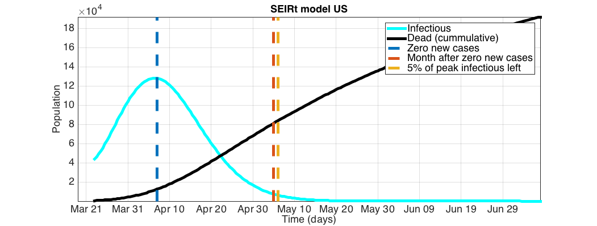
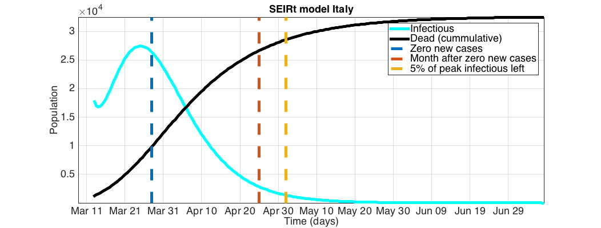

# SIR, SEIR and SEIRt modeling and inversion

The coronavirus (COVID-19) struck planet Earth in early 2020, just after immense wild-fires struck Australia, and a possible US-Iran armed conflict seemed imminent. It had been quite a year so far.

The entire planet went into quarantine. First for two weeks, then for a month, then ...

**Can we _estimate_ ahead of time how long we are to be locked down?**

Go to **Examples** below if you're not into reading. 

For the US and Europe, the data, the model, the inversion and the cut-off criteria suggest __late April - early May__.



## The SIR, SEIR and SEIRt models

These models attempt to capture the time-dependent dynamics of a population interacting with a virus. 

The model-state variables, for example, are __infected, recovered, dead, susceptible, quarantined__, etc.

The parameters that dictate these time-dependent dynamics are, for example, __infection rate, protection rate, cure rate, mortality__, etc.

I used the SIR model as given [here](https://en.wikipedia.org/wiki/Compartmental_models_in_epidemiology#Bio-mathematical_deterministic_treatment_of_the_SIR_model). 

The SEIR model is as given by [[1]](https://arxiv.org/pdf/2002.06563.pdf), although this one does not assume time dependency of any parameter.

The SEIRt model is as given by [[1]](https://arxiv.org/pdf/2002.06563.pdf), with time dependency of some parameters.

## The SIR, SEIR and SEIRt inversions

How long will we be locked up in quarantine?

Given the data of infected, recovered and dead - can we make an estimate on how the total population will behave in the future?

To answer this question we need to know the model parameters: infection rate, protection rate, cure rate, mortality, etc.

This package attempts to do just that using the _**adjoint method**_. The entire inversion routine is built from scratch.

A basic introduction to the adjoint method can be found in [[2]](https://cs.stanford.edu/~ambrad/adjoint_tutorial.pdf). 

Unfortunately, the adjoint method was not able to beat Matlab's ```lsqcurvefit```. This led for some examples to be a slightly different version of the ones in [[3]](https://github.com/ECheynet/SEIR). 

## Examples

All examples are in ```scripts/``` and are named,

1. ```sir_johnH_.m``` and ```sir_johnH.m```
1. ```seir_johnH_.m``` and ```seir_johnH.m```
1. ```seirt_johnH_.m``` and ```seirt_johnH.m```

The underscore determines the inversion method used:

* With underscore: Matlab's ```lsqcurvefit```.
* Underscore-free: Own _adjoint method_.

Out of all the models and methods, the SEIRt with ```lsqcurvefit``` gives the better looking fit. So use ```seirt_johnH_.m``` first (see below).


The data is downloaded from the [John Hopkins](https://github.com/CSSEGISandData/COVID-19/tree/master/csse_covid_19_data/csse_covid_19_time_series) github repo.

The folder ```data/archive``` has archived data downloaded April 7, 2020. If you'd rather use that, put those files in ```data/```.

If for some reason you chose a country and it didn't work, make sure the file  ```data/time_series_covid19_population_global.cvs``` has the population for that country and/or region.

### The ```seirt_johnH_.m``` example

This example takes data from the [John Hopkins](https://github.com/CSSEGISandData/COVID-19/tree/master/csse_covid_19_data/csse_covid_19_time_series) github repo and returns an estimate of when we will be able to leave our homes.


After having fitted the data to the SEIRt model from [[1]](https://arxiv.org/pdf/2002.06563.pdf), I manually compared the fitted _dead_ values to the _cummulative deaths_ values in [[5]](http://covid19.healthdata.org/). For many countries the match is close in value, +/- 1e3 at worst.

I then took the values for the fitted _infectious_ and compared them to the _all beds needed_ values in [[5]](http://covid19.healthdata.org/). For many countries the match is close in value (+/- 1e3) and in lag (+/- 3 days) at worst. 

However, I only use this match (between the fitted _infectious_ and the _all beds needed_ values) qualitatively: I assume _infectious_ gives a qualitative curve for current cases. 

This enables two useful properties, 

1. the time derivative of _infectious_ gives (qualitatively) new cases per time, 

1. the values of _infectious_ are proportional to current cases.



A possible way of ending the lockdown is some time after the last _infectious_ case. Using property 1, the zero crossing of dt(_infectious_) gives the time when no new cases arise (plotted in blue). In orange, a two month period after the last estimated _infectious_ case is shown.

Another way of ending the lockdown is when hospitals are relieved of COVID-19 cases. Yellow shows when only 5% of the peak of _infectious_ is reached. This rests on property 2.

__Estimate on lockdown end__

Most countries in the western northern hemisphere have the yellow (5% of peak cases) and orange (one month after last infected) cut-off times by __late April or early May__. In contrast other countries like Iran, Argentina and Peru show a yellow cut-off by __August__. 

More pictures in ```pics/```.

# Contact

domenzain.diego@gmail.com

diegodomenzain@mines.com

## References

[1] [_Peng et. al_. Epidemic analysis of COVID-19 in China by dynamical modeling](https://arxiv.org/pdf/2002.06563.pdf)

[2] [_Andrew M. Bradley_. PDE-constrained optimization and the adjoint method](https://cs.stanford.edu/~ambrad/adjoint_tutorial.pdf)

[3] [ECheynet](https://github.com/ECheynet/SEIR)

[4] [John Hopkings data](https://github.com/CSSEGISandData/COVID-19/tree/master/csse_covid_19_data/csse_covid_19_time_series)

[5] [The Institute for Health Metrics and Evaluation (IHME)](http://covid19.healthdata.org/)